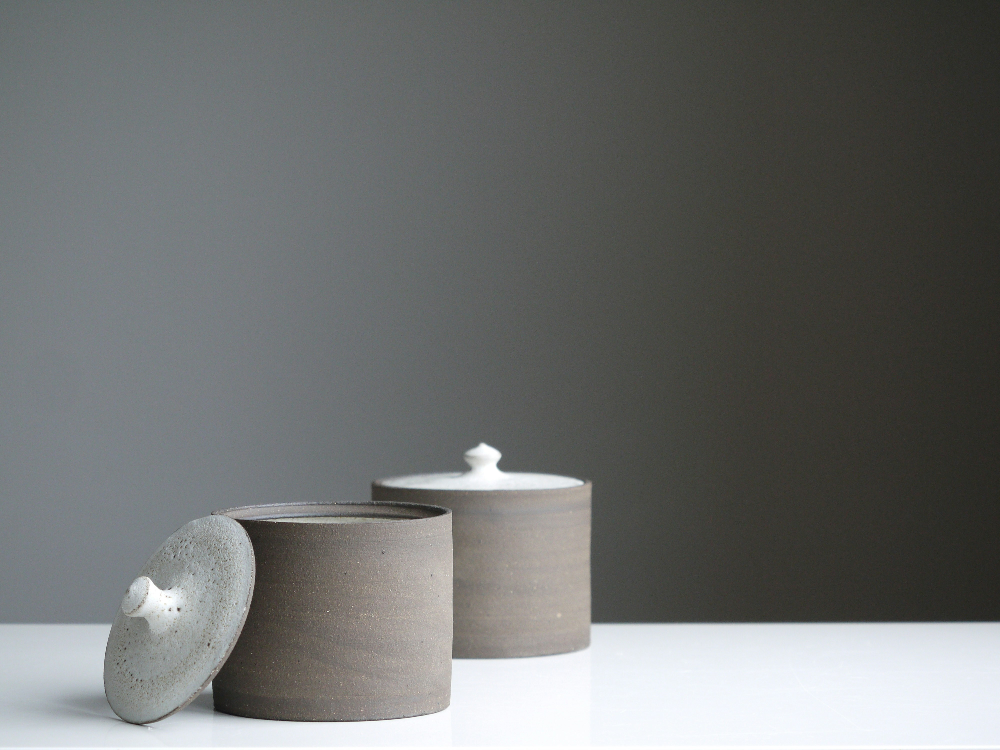
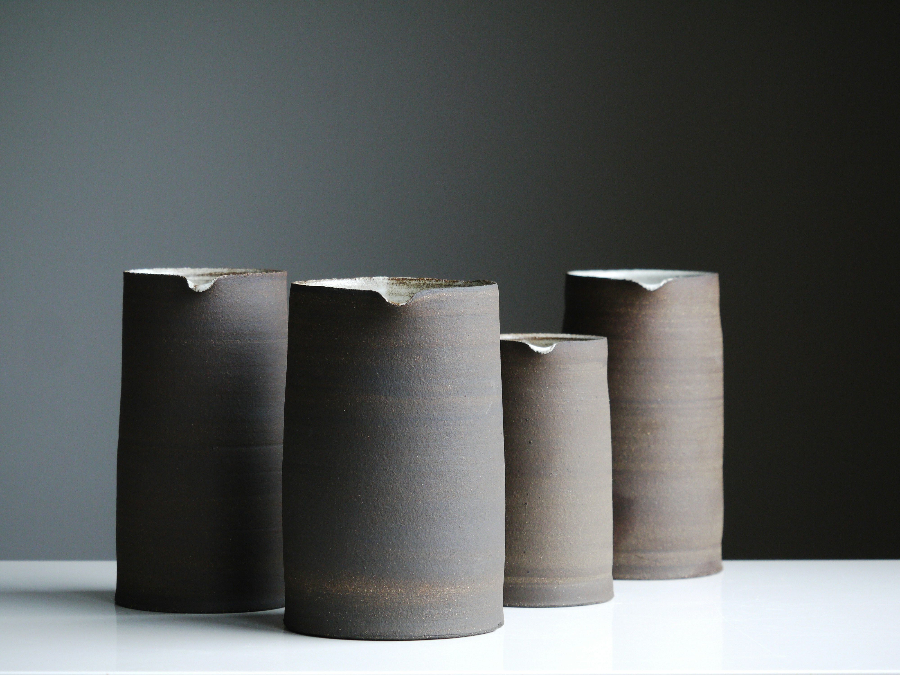

Design to HTML CODE

<!--Gallery section-->

    

        <!-- First Image Column -->
        

            
        

        <!-- Second Column with Nested Images -->
        

            

                
            

            

                

                    
                

                

                    
                

            

        

    

  

            <!-- Left Image -->
            

                
            

            <!-- Right Content -->
            

                <!-- Top Right Image -->
                

                    
                

                <!-- Bottom Right Images -->
                

                    

                        
                    

                    

                        
                    

                

            

        

